# ✈️ Travel Planner

This Travel Planner consist of 3 agents:

### 1. Researcher 
- Built based on a ReAct agent
- Takes an input question and tries to answer it with the help of an integrated Tavily Search tool. Returns its findings in Markdown format.

### 2. Planner 
- To be precise not an agent but one LLM call
- Returns a detailed Travel plan including flights, accomondation and a day to day intineary given the full message history of the orchestrator.

### 3. Orchestrator: 
- Analyzes trip requirements and coordinates between the researcher and planner agents 
- A graph with a LLM Call and a Tool Node.
- The provided tools are used to call either the researcher during planning or the planner once the outline is done and the required information was collected.

```mermaid
graph TD
    __start__([__start__]) --> llm_call
    llm_call[🧠 LLM Call<br/>Orchestrator reasoning]
    llm_call -->|has tool calls| tool_call
    llm_call -->|no tool calls| llm_call
    tool_call[🔧 Tool Call<br/>Execute tools]
    tool_call -->|call_researcher| researcher
    tool_call -->|call_planner| planner
    
    subgraph researcher[📚 Researcher Agent]
        direction TB
        r_llm[LLM] --> r_tavily[🔍 Tavily Search]
        r_tavily --> r_llm
    end
    
    researcher --> llm_call
    
    planner[✍️ Planner<br/>Generate itinerary]
    planner --> __end__([__end__])
```



## Setup

### Prerequisites

- Python 3.10+
- Poetry
- API keys for:
  - OpenAI or Anthropic (LLM)
  - Tavily (web search)
  - Langfuse (optional, for tracing)

### Installation

1. Clone the repository:
```bash
git clone https://github.com/LennartFiebig/travel-planner.git
cd travel-planner
```

2. Install dependencies:
```bash
poetry install
```

3. Create a `.env` file with your API keys:
```bash
ANTHROPIC_API_KEY=your-anthropic-key

TAVILY_API_KEY=your-tavily-key

# Optional: Langfuse for tracing
LANGFUSE_PUBLIC_KEY=your-public-key
LANGFUSE_SECRET_KEY=your-secret-key
LANGFUSE_HOST=https://cloud.langfuse.com
```

## Usage

### Streamlit UI

Run the web application:
```bash
poetry run streamlit run travel_planner/app.py
```

Then open http://localhost:8501 in your browser.

